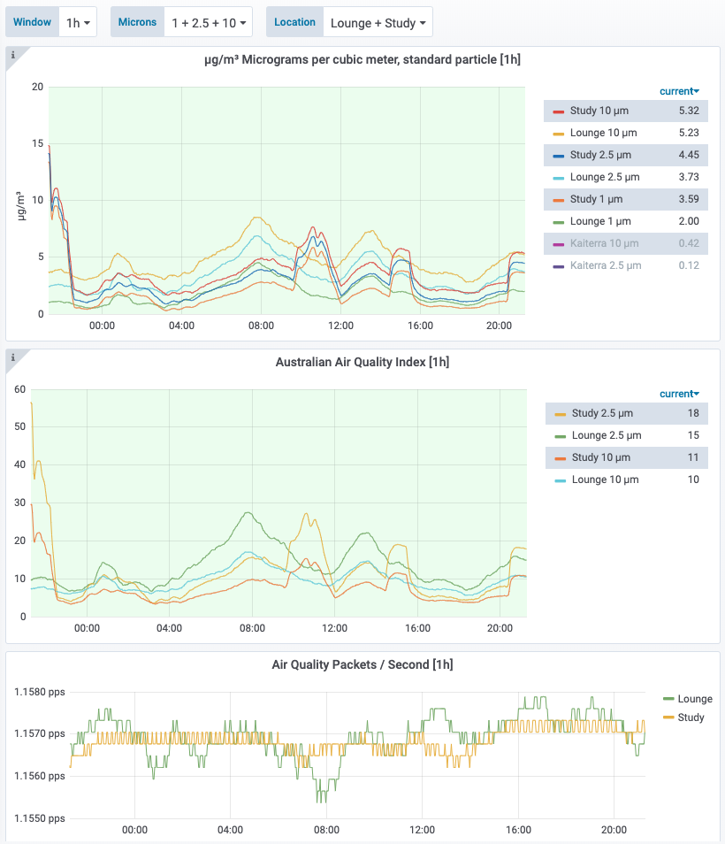

# Breathe

A [Prometheus](https://prometheus.io/) exporter for [PMS5003](https://www.aqmd.gov/docs/default-source/aq-spec/resources-page/plantower-pms5003-manual_v2-3.pdf) Particulate Matter/Air Quality sensors.

Pushed to [Docker Hub](https://hub.docker.com/repository/docker/markhnsn/breathe)

Pair with Grafana for beautiful dashboarding:



Example usage:

```shell
$ go build
$ ./breathe --port=:9662 --portname=/dev/serial0

$ curl http://localhost:9662/metrics

...
# HELP pms_packet_checksum_errors 
# TYPE pms_packet_checksum_errors counter
pms_packet_checksum_errors 0
# HELP pms_particle_counts Number of particles with diameter beyond given number of microns in 0.1L of air
# TYPE pms_particle_counts gauge
pms_particle_counts{microns_lower_bound="10"} 34
pms_particle_counts{microns_lower_bound="100"} 0
pms_particle_counts{microns_lower_bound="25"} 0
pms_particle_counts{microns_lower_bound="3"} 954
pms_particle_counts{microns_lower_bound="5"} 254
pms_particle_counts{microns_lower_bound="50"} 0
# HELP pms_particulate_matter_environmental micrograms per cubic meter, adjusted for atmospheric environment
# TYPE pms_particulate_matter_environmental gauge
pms_particulate_matter_environmental{microns="1"} 4
pms_particulate_matter_environmental{microns="10"} 6
pms_particulate_matter_environmental{microns="2.5"} 6
# HELP pms_particulate_matter_standard Micrograms per cubic meter, standard particle
# TYPE pms_particulate_matter_standard gauge
pms_particulate_matter_standard{microns="1"} 4
pms_particulate_matter_standard{microns="10"} 6
pms_particulate_matter_standard{microns="2.5"} 6
# HELP pms_received_packets 
# TYPE pms_received_packets counter
pms_received_packets 27655
# HELP pms_skipped_bytes 
# TYPE pms_skipped_bytes counter
pms_skipped_bytes 0
```

Example docker-compose.yml:

```yml
version: '3.4'
services:
  breathe:
    image: markhnsn/breathe
    restart: always
    ports:
      - "9662:9662"
    command: [
      "--port", ":9662",
      "--portname", "/dev/serial0"
    ]
    devices:
      - "/dev/serial0"
```

Example prometheus.yml:

```yml
scrape_configs:
  - job_name: 'breathe'
    static_configs:
      - targets: ['breathe:9662']
        labels:
          location: 'Lounge'
```
